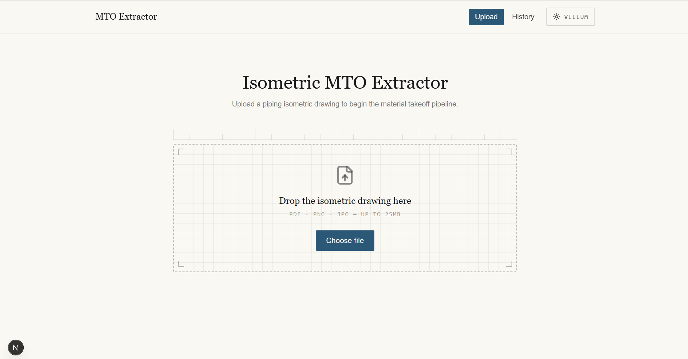

# Isometric MTO Extractor

Upload a piping isometric drawing (PNG/JPG/PDF) and get back a structured
Material Take-Off (MTO): pipe, fittings, flanges, valves, gaskets and bolt
sets, with quantities, sizes, schedules/ratings and material specs, plus
a CSV/JSON/Excel export.

Built incrementally across 11 phases (full log in the
[Appendix](#appendix-phase-by-phase-development-log) below). This section
is the evaluator-facing summary: overview, setup, environment variables,
AI pipeline design, assumptions/limitations, and what's next.

# Screenshots

## Upload Drawing



## Result


## Generated CSV


## 1. Overview & architecture

```
                      ┌─────────────────────────┐
                      │   Next.js frontend       │
                      │  upload → results page   │
                      └────────────┬────────────┘
                                   │ multipart POST /api/v1/mto
                                   ▼
                      ┌─────────────────────────┐
                      │   FastAPI backend        │
                      │                          │
   ┌──────────────────┼────────────┬─────────────┼──────────────────┐
   │                  │            │             │                  │
   ▼                  ▼            ▼             ▼                  ▼
 OCR            Vision (Gemini)  Graph/CV     Business rules   Symbol detect.
 title-block    PRIMARY MTO      (bonus,      (bonus: gasket/  (bonus, YOLOv11,
 fields         item source:     structural   bolt derivation, no weights
 (bonus)        pipe/fitting/    topology)    duplicates)      shipped -
                flange/valve,                                  degrades to
                mock fallback                                  "unavailable")
 └──────┬───────────┬──────────────┬──────────────┬─────────────────┘
        │           │              │              │
        └───────────┴──────┬───────┴──────────────┘
                            ▼
              MTOExtractionPipeline.run()
           (composes results, never blocks on
            a bonus stage - each is wrapped in
            an 8s timeout and degrades cleanly)
                            │
                            ▼
              SQLite persistence + CSV/JSON/XLSX export
```

**Only one component produces the actual MTO line items (PIPE/FITTING/
FLANGE/VALVE/GASKET/BOLT rows): the Gemini vision-extraction pipeline**
(`backend/app/services/vision_extraction/`), per spec section 3.3. OCR,
classical-CV graph construction, business rules, and YOLO symbol
detection are all supplementary structural analysis - genuinely useful
signal when they work, but the app never depends on any of them to
produce a usable MTO, and each one degrades independently and cleanly
(see section 4).

## 2. Setup

**Requirements:** Python 3.11+ (tested on 3.12), Node.js 18+.

### Backend

```bash
cd backend
python -m venv venv && source venv/bin/activate    # Windows: venv\Scripts\activate
pip install -r requirements.txt
cp .env.example .env
# Optional: put a real Gemini key in .env - see section 3. Blank is fine.
uvicorn app.main:app --reload --port 8000
```

Verify: `curl http://localhost:8000/api/v1/health` should return
`{"status":"ok",...}`, and http://localhost:8000/docs should load Swagger.

### Frontend

```bash
cd frontend
npm install
cp .env.local.example .env.local
npm run dev
```

Open http://localhost:3000, drop in a PDF/PNG/JPG, and the results page
shows the drawing preview, the MTO table, summary chips, and CSV/JSON/
Excel download links.

### Docker (optional)

```bash
docker compose up --build
```

## 3. Environment variables (`.env.example`)

| Variable | Purpose | Required? |
|---|---|---|
| `GEMINI_API_KEY` | Google AI Studio key used by the vision extraction pipeline to produce MTO items | **No** - blank runs the deterministic mock MTO end-to-end |
| `GEMINI_MODEL` | Gemini model name (default `gemini-2.5-flash`) | No |
| `GEMINI_TIMEOUT_SECONDS` | HTTP timeout for the Gemini call | No |
| `OCR_LANG`, `OCR_USE_GPU`, `OCR_USE_ANGLE_CLS` | PaddleOCR config for the bonus title-block-reading stage | No |
| `YOLO_WEIGHTS_PATH`, `YOLO_CONFIDENCE_THRESHOLD`, `YOLO_DEVICE` | Bonus symbol-detection stage; no weights are shipped (see section 4) | No |
| `CORS_ORIGINS`, `DATABASE_URL`, `UPLOAD_DIR`, `MAX_UPLOAD_SIZE_MB` | General app config | No, sane defaults |

No real keys are committed anywhere in this repo; `.env` is gitignored.

## 4. How the AI pipeline works

1. **Pre-process**: PDF pages are rendered to an image; the image is
   deskewed/denoised/resized (`app/services/preprocessing/`).
2. **Extract**: the preprocessed PNG is sent to Gemini
   (`app/services/vision_extraction/client.py`) with a prompt and strict
   JSON schema (`app/services/vision_extraction/prompt.py` - read this,
   it's part of the deliverable). The prompt explicitly tells the model
   the drawing may be "a clean CAD isometric OR a hand-marked/annotated
   field copy (grid paper, hand-drawn circles, arrows, highlighter
   marks, stamps)" and to read through that noise - written specifically
   because our own test drawing is a hand-marked thickness-survey
   isometric, not a clean CAD export.
3. **Validate**: the raw response is validated against Pydantic models
   (`app/schemas/vision_extraction.py`); invalid/unparseable JSON is
   treated as a failure, not a crash.
4. **Graceful fallback**: if `GEMINI_API_KEY` is blank, the request
   fails, or validation fails, the pipeline falls back to a
   deterministic mock MTO (`app/services/vision_extraction/mock.py`) -
   never an empty result, never a 500. Every response reports
   `extraction_source` (`"gemini"` or `"mock"`) and `used_mock` so this
   is never silently hidden.
5. **Derive & summarize**: gasket/bolt-set rows are derived (one set per
   flanged joint) if Gemini didn't already report them
   (`app/services/vision_extraction/derive.py`); pipe is summed by NPS,
   everything else counted, matching section 2.2's conventions.
6. **Bonus layers, composed but never blocking**: OCR title-block
   reading, classical-CV pipe/graph topology, YOLOv11 symbol detection,
   and business-rules hardware/violation checks all run alongside the
   vision extraction and add supplementary fields (`node_count`,
   `hardware`, `violations`, `symbol_detection.enabled`, etc.) when they
   succeed. Each one is wrapped in an **8-second hard timeout**
   (`app/services/mto/pipeline.py::_run_with_timeout`) and independently
   catches its own unavailability - so a slow OCR download, a missing
   YOLO weights file, or a pathological classical-CV case on a dense
   drawing degrades that one stage only, and the MTO items you actually
   came for are unaffected.

## 5. Assumptions & known limitations

- **No YOLOv11 weights are shipped** (a training artifact, excluded per
  the size/content rules). `POST /detect` and the `symbol_detection`
  field in `/mto` responses report this explicitly rather than
  fabricating detections. The MTO itself does not depend on it.
- **The Gemini vision pipeline is the accuracy ceiling.** It will do
  best on legible, moderately dense CAD-style isometrics with a clear
  title block. It will do worse on: very dense/cluttered drawings,
  low-resolution phone photos, heavily rotated/skewed text, and
  drawings where the BOM table conflicts with the drawn symbols (we
  don't currently reconcile the two - Gemini is asked to read the
  drawing itself, not transcribe an existing BOM table).
- **Confirmed failure mode on our own bundled sample.** Our test
  drawing is a UT thickness-survey marking sheet (~40 circled
  measurement-point tags on a graph-paper background), not a
  conventional B16.9/B16.5 fabrication isometric. A live Gemini run
  against it returned an internally-consistent but almost certainly
  inaccurate MTO: 44 fitting-category rows (suspiciously close to the
  number of circled tags on the sheet - the model most likely read
  some of those inspection-point circles as fitting symbols) against
  only 1.22 m of total pipe length, which is physically implausible
  for that many fittings. This is exactly the "dense/hand-drawn iso"
  failure mode the assessment brief asks us to name: the pipeline
  works and degrades cleanly, but its *accuracy* on a drawing type this
  different from a standard isometric should not be trusted without a
  domain-appropriate fitting-symbol dataset (see section 6).
- **The bonus classical-CV stack (OCR, Hough-transform pipe tracing,
  skeletonization) assumes a relatively clean isometric.** On a
  genuinely messy hand-marked field drawing (heavy background grid,
  hundreds of annotation circles - like our own bundled sample), these
  algorithms can take far longer than on a clean drawing rather than
  simply failing fast. We handle this with the 8-second per-stage
  timeout described above, so the endpoint always returns rather than
  hanging, but the *supplementary* fields (topology, OCR title-block
  fields) may be empty on such drawings even though the *primary* MTO
  (from Gemini) is unaffected.
- **Units**: NPS in inches, lengths in metres, per spec section 2.2.
- **PaddleOCR model download requires outbound internet on first run**;
  if that's unavailable (e.g. a sandboxed eval environment), OCR
  degrades to `OCR_UNAVAILABLE` and the pipeline continues without it.
- **Preprocessing is cached per request.** OCR, graph construction, and
  business rules (which internally re-runs its own OCR *and* graph
  construction) each used to independently re-run the full
  deskew/denoise/resize/contrast chain on the same uploaded bytes - up
  to 5 times per request. On our dense sample that chain alone took
  ~30s, so one upload could pay that cost 5x (~150s) before any
  Gemini/OCR work even started - most of an observed ~287s end-to-end
  run. A small content-hash-keyed cache in
  `app/services/preprocessing/pipeline.py` now means that chain runs
  once per distinct upload regardless of how many stages ask for it.

## 6. What we'd improve with more time

- Reconcile Gemini's read of the drawing against an OCR'd BOM table
  when both are present, instead of trusting Gemini's read alone.
- Replace the fixed 8-second bonus-stage timeout with a size/density-
  aware budget (a quick heuristic on annotation density before
  committing CV time to a drawing).
- Train a YOLOv11 symbol detector on a properly labelled fitting-type
  dataset (elbow/tee/reducer/valve/flange/support/weld) to make symbol
  detection a genuine second signal instead of purely informational -
  the Roboflow dataset we experimented with turned out to be labelled

  for a different purpose (thickness-survey annotation tags, not
  fitting types) and wasn't usable for this.
- Async job queue (`POST /upload` returning a `job_id` immediately) for
  large/slow drawings instead of the current synchronous `POST /mto`.
- Confidence-based UI highlighting per MTO row (schema already carries
  `confidence`; not yet surfaced as color-coding in the frontend).

---

## Appendix: Phase-by-phase development log

The sections below are the original build log, kept for anyone who
wants the full incremental history of how each phase was implemented
and tested.

## Phase 11 scope (this build)

- **`/mto` now reports symbol-detection availability explicitly.** Every
  earlier phase already degraded gracefully when no trained YOLO weights
  were configured (`graph_construction/pipeline.py` and
  `business_rules/pipeline.py` have each caught `DetectionUnavailableError`
  since Phase 6/7, and `/mto` has never returned `500`/`503` because of a
  missing weights file). What Phase 11 adds is a small, purely
  **informational** field so a person - or the frontend - doesn't have to
  infer detector availability from the `warnings` list:

  ```json
  {
      "status": "extracted",
      "symbol_detection": { "enabled": false, "reason": "YOLO weights file not found at './data/weights/yolov11_piping.pt'. ..." },
      "drawing_number": "...",
      "hardware": [...],
      "violations": [...]
  }
  ```

  - `MTOExtractionPipeline._check_symbol_detection_availability()`
    (`app/services/mto/pipeline.py`) calls
    `get_detection_engine()` once per run purely to observe whether it
    raises - the cached engine/failure state in
    `app/services/detection/engine.py` means this never re-triggers real
    model-loading work beyond what `graph_construction`/`business_rules`
    already do internally. **This check never blocks or gates the rest of
    the pipeline** - OCR, graph construction, business rules, persistence,
    and CSV/JSON/XLSX export all run exactly as before regardless of its
    result.
  - When weights are missing (or fail to load, or `ultralytics` isn't
    installed), a single `logger.warning(...)` line is emitted - never a
    stack trace - and `symbol_detection.enabled` is `false` with a
    human-readable `reason`. When a valid weights file is found,
    `enabled` is `true` and `reason` is `null`.
  - Persisted on `MTOExtractionRun` (`symbol_detection_enabled`,
    `symbol_detection_reason`) and included in `/mto/{id}` and the
    `/mto/{id}/export` summary section for every format, so history and
    exports show whether a given run had detection available even after
    the fact.
  - **Frontend:** the results header (`components/upload/UploadForm.tsx`)
    and the history detail page
    (`app/history/[id]/page.tsx`) show a
    `Symbol Detection: Not Available (Running OCR + Graph Pipeline)` badge
    whenever `symbol_detection.enabled` is `false`. No other part of the
    UI is disabled or hidden when this badge is showing - the title-block
    table, pipe-network stats, hardware table, violations, and CSV/JSON/
    Excel downloads all render from whatever OCR + graph-geometry data is
    available, exactly as they did before this phase.
  - **No architecture changes.** No existing route, pipeline, or service
    was rewritten or removed; no API contract was broken (only new,
    optional-shaped fields were added). YOLO symbol detection was already
    optional end-to-end as of Phase 6 - this phase makes that fact visible
    in the response instead of only in server logs and warning strings.

## Phase 10 scope (prior build)

- **Complete frontend rebuild.** The upload page (Phase 1) now orchestrates the
  full pipeline and presents a real results dashboard instead of a bare
  "received" acknowledgement:
  - **Drawing preview** - shows the exact *processed* image (Phase 2's
    contrast-enhanced, resized preview) rather than the raw upload, because
    that's the same coordinate space Phase 4's detections are computed in.
  - **Bounding box overlay** (`components/results/DrawingPreview.tsx`) - an
    SVG layer scaled to the image's native `viewBox`, so boxes stay pixel-
    accurate at any rendered size with no JS resize listeners needed. Each
    fitting class gets a consistent color; hovering a box shows its class
    and confidence. Degrades to "detection unavailable" if Phase 4 has no
    trained weights configured, rather than showing nothing or crashing.
  - **Confidence dashboard** (`components/results/ConfidenceDashboard.tsx`) -
    OCR title-block fields with per-field confidence bars, a detected-symbol
    bar chart by class, pipe-network topology stats (nodes/runs/branches/
    dead ends/loops/connectivity), the generated hardware table, and
    business-rule findings as severity-coded badges.
  - **Downloads** (`components/results/ExportButtons.tsx`) - CSV/JSON/Excel
    export links wired straight to Phase 8's `/mto/{id}/export`.
  - **History** (`app/history/page.tsx`, `app/history/[id]/page.tsx`) - a
    paginated register of every past run and a per-run detail view (no
    image preview there - Phase 8 doesn't persist the original image, only
    the extraction results, and the UI says so rather than pretending
    otherwise).
  - **Dark mode is a literal blueprint, not just an inverted light mode** -
    light mode stays the vellum-and-graphite drafting table from Phase 1;
    dark mode (`print`/`linework` in `tailwind.config.ts`) is a deep
    cyanotype blue with white/cyan linework, the actual origin of the word
    "blueprint." A small inline script in `app/layout.tsx` applies the
    saved preference before paint so switching themes never flashes the
    wrong one on reload.
  - **Responsive** throughout - the results grid stacks to one column
    below `lg`, the header nav and history table degrade gracefully on
    narrow viewports, and every interactive element has a visible focus
    ring.
- The upload flow now calls `/preprocess`, `/ocr`, `/detect`, and `/mto`
  together for each drawing: `/mto` is the source of truth (and the one
  that persists), while the other three are independently best-effort so
  the dashboard degrades one section at a time rather than all-or-nothing
  if, say, no YOLO weights are configured.
- **Backend is otherwise untouched** - every route from Phases 1-9 is
  exactly as it was. The one real code change this phase required was a
  **test-suite fix, not a feature**: `ultralytics` installs its own
  top-level `tests` package into site-packages, which was silently
  shadowing this project's local `tests/` directory (Python resolves an
  import-less "namespace" test folder after a same-named *regular*
  package found later on `sys.path`). Adding `tests/__init__.py` makes the
  local package resolve first, as it always should have.

## Phase 9 scope (prior build)

- **New:** `POST /api/v1/verify` - sends the drawing image plus everything
  already extracted by Phases 3/4/6/7 (OCR title-block fields, detection
  class counts, graph topology summary, business rules summary) to
  **Gemini, for review only**. Per the project-wide rule, Gemini may only:
  - **suggest corrections** to data that was already extracted
  - **find missing items** - fittings/symbols/text visible in the drawing
    that don't appear anywhere in the extraction
  - **flag OCR mistakes** - specific recognized text that looks wrong
    given the image

  **Gemini must never regenerate or replace the extraction.** This
  endpoint doesn't let a Gemini response overwrite anything Phases 1-8
  already produced - it only ever adds `corrections`/`missing_items`/
  `ocr_flags` alongside it, and the system instruction sent to Gemini
  (`app/services/gemini_verification/client.py`) explicitly constrains it
  to that reviewer role with a fixed three-key JSON response schema.

  Talks to Google's Generative Language API directly via `httpx` (already
  a dependency for testing - no new SDK, no new install footprint).

  **If `GEMINI_API_KEY` isn't configured, this skips cleanly** - before
  running any of the (comparatively expensive) upstream OCR/detection/
  graph/business-rules pipelines at all - and returns `available: false`
  with a clear warning, `200 OK`, never a crash. The same graceful
  degradation applies if the request to Gemini fails for any other reason
  (network error, timeout, non-200 response, malformed JSON) - verified
  against the *real* Google API with a deliberately invalid key during
  testing (not mocked), which genuinely returns a rejected-request error
  that gets caught and turned into a clean unavailable result.

- Every earlier endpoint (`/extract`, `/preprocess`, `/ocr`, `/detect`,
  `/pipes`, `/graph`, `/business-rules`, `/mto`) is unchanged and still
  fully functional - `/verify` is additive, and nothing it returns is
  persisted by Phase 8 or feeds back into any other endpoint's output.

## Phase 8 scope (prior build)

- **New:** `POST /api/v1/mto` - runs the full extraction pipeline (Phase 3
  OCR + Phase 6 graph + Phase 7 business rules, combined) against an
  uploaded drawing and **persists the result to SQLite** via
  `app/core/database.py` (SQLAlchemy engine/session) and
  `app/repositories/mto_run_repository.py` (repository pattern - routes
  and services never issue SQL directly). Nothing new is extracted in
  this phase; it's composition + persistence + export over what Phases
  3/6/7 already produce, and no earlier phase's code is modified.
- **New:** `GET /api/v1/mto/history` - paginated list of past runs
  (filename, timestamp, drawing number/revision, node/hardware/violation
  counts) without re-running anything.
- **New:** `GET /api/v1/mto/{id}` - full stored detail for one run.
- **New:** `GET /api/v1/mto/{id}/export?format=csv|json|xlsx` - downloads
  that run's summary + hardware + violations as CSV (`csv` module), JSON,
  or a 3-sheet Excel workbook (`openpyxl` - Summary/Hardware/Violations).
  A missing run id returns a structured `404 RUN_NOT_FOUND` for both the
  detail and export endpoints, never a raw stack trace.
- Every earlier endpoint (`/extract`, `/preprocess`, `/ocr`, `/detect`,
  `/pipes`, `/graph`, `/business-rules`) is unchanged and still fully
  functional and independently callable - `/mto` is additive, not a
  replacement.

  **No AI is used anywhere in this phase** - persistence is a plain
  SQLAlchemy model/repository, and export is deterministic serialization
  of already-computed data, per the project-wide rule that Gemini only
  reviews (Phase 9), never extracts or generates on its own.

## Phase 7 scope (prior build)

- **New:** `POST /api/v1/business-rules` - takes Phase 6's constructed graph
  (plus Phase 4 detections and Phase 3 OCR fields as best-effort inputs) and
  applies deterministic business rules - **no learned model, no Gemini,
  anywhere in this phase**:
  - **Hardware generation** (`app/services/business_rules/hardware_generator.py`
    + `bolt_table.py`) - for every graph node Phase 6 tagged as a detected
    `flange`, generates 1 gasket, N stud bolts, and 2N nuts (a stud bolt
    threads on both ends and needs one nut per end). N and the bolt
    diameter come from a small illustrative NPS/rating-class lookup table
    (loosely modeled on ASME B16.5 Class 150/300 practice - **not a
    substitute for the governing piping spec**; any non-exact match is
    flagged `is_estimated: true` rather than silently presented as exact).
    Sizing uses Phase 3's OCR-extracted NPS/material class as the best
    available estimate for every flange on the sheet.
  - **Duplicate fitting detection** (`duplicate_detection.py`) - flags
    pairs of Phase 4 detections of the same class with heavily overlapping
    bounding boxes (IoU-based) as likely duplicate detections of one
    physical symbol.
  - **Missing fitting** - a graph branch point (3+ connected pipe runs)
    with no detected fitting nearby (a tee/cross symbol likely missed).
  - **Unterminated pipe** - a dead end (1 connected run) with no detected
    terminating fitting (cap, flange, valve) - the run appears to just
    stop on the drawing.
  - **Invalid reducer** - a node detected as a `reducer` that doesn't sit
    between exactly one upstream and one downstream run (a reducer at a
    dead end or a branch is topologically invalid for what the symbol
    represents).
  - **Impossible connection** - two fittings joined by a near-zero-length
    pipe run, which generally can't represent two fittings mounted with no
    pipe spacing between them.
  - Response includes `hardware` (gasket/stud_bolt/nut line items),
    `violations` (rule code, severity, message, affected node ids), and
    `duplicate_fittings`.
  - Symbol detection (for duplicates and fitting-based checks) and OCR
    (for hardware sizing) are both **best-effort**: with no trained YOLO
    weights configured (none are shipped in this repo), the connectivity
    rules still run against the graph geometry, hardware generation
    correctly produces nothing (no flanges were ever detected to generate
    hardware for), and a warning notes what was skipped - never a
    fabricated result and never a hard failure.

  **No AI is used anywhere in this phase** - hardware quantities are a
  deterministic lookup, and every violation is graph/geometry reasoning
  over Phase 6's output, per the project-wide rule that Gemini only
  reviews (Phase 9), never extracts, generates, or validates on its own.

- Phase 1's `GET /api/v1/health` / `POST /api/v1/extract`, Phase 2's
  `POST /api/v1/preprocess`, Phase 3's `POST /api/v1/ocr`, Phase 4's
  `POST /api/v1/detect`, Phase 5's `POST /api/v1/pipes`, and Phase 6's
  `POST /api/v1/graph` are unchanged and still fully functional.

## Phase 6 scope (prior build)

- **New:** `POST /api/v1/graph` - takes Phase 5's straight `PipeSegment`s and
  builds an actual connectivity graph with **NetworkX only** (no learned
  model anywhere in this phase):
  1. **Branch-point splitting** (`app/services/graph_construction/branch_splitting.py`) -
     a branch line tees into the *middle* of a main run far more often than
     it meets it end-to-end, so before nodes are built, any segment whose
     interior is landed on by another segment's endpoint (within tolerance,
     and not just a near-corner overlap) gets split there. Without this
     step a T-junction would silently come back as two disconnected pieces.
     Deliberately **not** handled: two lines that merely cross with neither
     endpoint landing on the other - in isometric drawing convention that's
     two unconnected pipes overlapping in the 2D projection, not a fitting,
     and treating it as a junction would spuriously merge unrelated runs.
  2. **Node construction** (`node_builder.py`) - clusters (union-find) every
     segment endpoint within a snap tolerance into one shared junction node,
     since skeletonization/Hough noise means two segments meeting at an
     elbow almost never share an *exactly* equal coordinate.
  3. **Graph construction** (`graph_builder.py`) - builds a NetworkX
     `MultiGraph` (not a plain `Graph` - two distinct pipe runs can
     legitimately connect the same two junctions, and collapsing that would
     hide real topology and real loops).
  4. **Fitting association** (`fitting_association.py`) - best-effort: if
     Phase 4's YOLO detector is available and found anything, the nearest
     detected fitting within range is tagged onto each junction node. If
     no trained weights are configured (none are shipped in this repo),
     this degrades to a warning - the graph is still built from pipe
     geometry alone, never a hard failure.
  5. **Structural analysis** (`analysis.py`) - branch points (degree ≥ 3),
     dead ends (degree == 1), loops (`nx.cycle_basis` plus parallel-edge
     loops the collapsed simple-graph view can't see on its own), and
     connectivity (`nx.connected_components`).
  - Response includes `nodes` (with position, degree, `is_dead_end`,
    `is_branch`, and `fitting_type` if Phase 4 matched one), `edges`,
    `branch_node_ids`, `dead_end_node_ids`, `loops`, `connected_components`,
    and `is_fully_connected`.
  - A blank/geometry-free drawing returns an empty graph with a warning -
    never a fabricated result.

  **No AI is used anywhere in this phase** - pure graph theory over Phase
  5's OpenCV-derived geometry, per the project-wide rule that Gemini only
  reviews, never extracts.

- Phase 1's `GET /api/v1/health` / `POST /api/v1/extract`, Phase 2's
  `POST /api/v1/preprocess`, Phase 3's `POST /api/v1/ocr`, Phase 4's
  `POST /api/v1/detect`, and Phase 5's `POST /api/v1/pipes` are unchanged
  and still fully functional.

## Phase 5 scope (prior build)

- **New:** `POST /api/v1/pipes` - accepts a PDF/PNG/JPG drawing, runs it
  through the Phase 2 preprocessing pipeline, then extracts straight pipe
  runs using **OpenCV/scikit-image only** (no learned model anywhere in
  this phase):
  1. **Skeletonize** (`app/services/pipe_extraction/skeletonize.py`) -
     `skimage.morphology.skeletonize` thins the Phase 2 binarized output
     down to a 1px-wide topological skeleton, so a 6px-wide inked line
     doesn't get picked up as two or three parallel edges downstream.
  2. **Hough transform** (`app/services/pipe_extraction/hough.py`) -
     `cv2.HoughLinesP` extracts raw straight line segments from the
     skeleton.
  3. **Polyline extraction** (`app/services/pipe_extraction/polyline.py`) -
     merges raw Hough segments that are collinear, same-orientation, and
     close together along their shared direction into single straight
     `PipeSegment`s, each classified `horizontal` / `vertical` / `diagonal`
     (diagonal covers conventional isometric pipe angles). This
     deliberately does *not* connect different-orientation runs into
     multi-vertex polylines yet - which run connects to which at an elbow
     is graph-level reasoning that belongs to Phase 6.
  - Response includes both `raw_segment_count` (pre-merge) and the final
    merged `segments` (with `start`/`end`/`length_px`/`angle_degrees`/
    `orientation`/`source_segment_count`), so the merge's effect is visible.
  - A drawing with no straight runs (blank, or symbols/text only) returns
    an empty `segments` list with a warning - never a fabricated result.

  **No AI is used anywhere in this phase** - pure OpenCV/scikit-image
  geometry, per the project-wide rule that Gemini only reviews, never
  extracts, and pipe/graph extraction must come from vision + graph logic.

- Phase 1's `GET /api/v1/health` / `POST /api/v1/extract`, Phase 2's
  `POST /api/v1/preprocess`, Phase 3's `POST /api/v1/ocr`, and Phase 4's
  `POST /api/v1/detect` are unchanged and still fully functional.

## Phase 4 scope (prior build)

- **New:** `POST /api/v1/detect` - accepts a PDF/PNG/JPG drawing, runs it
  through the Phase 2 preprocessing pipeline, then through **YOLOv11
  (Ultralytics)**, and returns structured symbol/fitting detections:
  - Classes: `elbow`, `tee`, `reducer`, `gate_valve`, `globe_valve`,
    `check_valve`, `flange`, `support`, `weld` (see
    `app/services/detection/classes.py` - the single source of truth for
    class id → name, must match the trained weights' class order)
  - Each detection: class name, confidence, bounding box (`x1,y1,x2,y2`)
  - `counts_by_class` - a quick per-class tally, useful once Phase 7's
    business rules need "how many gate valves on this drawing"
  - Detection runs against the same contrast-enhanced preview image OCR
    uses (Phase 3), so bounding boxes from both endpoints share a
    coordinate space - this matters once Phase 6 correlates OCR text and
    detected symbols into a single graph.

  **Gemini is never used for detection** (project-wide rule) - every
  detection above comes from the YOLOv11 model directly, nothing else.

  **No trained weights are shipped in this repo** (a project-specific
  training artifact, not something pip installs). Until you place one at
  `YOLO_WEIGHTS_PATH` (default `./data/weights/yolov11_piping.pt`), the
  endpoint returns a structured `503 DETECTION_UNAVAILABLE` error instead
  of crashing or fabricating detections - same as Phase 3's `OCR_UNAVAILABLE`
  pattern. This is verified with real (non-mocked) tests - see "Running
  backend tests" below. The engine also refuses to use a weights file whose
  class count doesn't match the 9 expected classes, to avoid silently
  mislabeling detections.

- Phase 1's `GET /api/v1/health` / `POST /api/v1/extract`, Phase 2's
  `POST /api/v1/preprocess`, and Phase 3's `POST /api/v1/ocr` are unchanged
  and still fully functional.

## Windows notes (target deployment platform)

This project is developed for and tested against **Windows** as the target
runtime, in addition to the Linux Docker path.

- **PaddleOCR/PaddlePaddle version pin is deliberate.** `requirements.txt`
  pins `paddlepaddle==2.6.2` + `paddleocr==2.9.1` (the last PaddleOCR 2.x
  line) rather than the newer PaddleOCR 3.x. Both have prebuilt Windows
  wheels for Python 3.11 (`cp311-win_amd64`) - no Visual Studio/C++ Build
  Tools needed to install them. PaddleOCR 3.x uses a different, heavier
  pipeline API (`.predict()` instead of `.ocr()`) and was deliberately
  avoided for now to keep the Windows install path simple and reproducible.
- **Use a clean virtual environment.** `python -m venv venv` before
  installing - a global/shared Python install with a different pre-existing
  `numpy` or `opencv-python` version is the most common source of Windows
  install issues with this stack.
- **First OCR request is slow.** PaddleOCR downloads its detection/
  recognition/angle-classification model weights (a few hundred MB total)
  to `%USERPROFILE%\.paddleocr` on the *first* call to `/ocr`, not at
  server startup. That first request needs internet access and may take
  a minute or two; subsequent requests reuse the cached models and are
  fast. If there's no internet access when that first call happens, you'll
  get a clean `503 OCR_UNAVAILABLE` response (see Phase 3 scope above) -
  not a crash.
- **Known `cv2` import quirk:** `paddleocr` unconditionally depends on both
  `opencv-python` and `opencv-contrib-python` (see the comment in
  `requirements.txt`), which can occasionally leave a mixed/broken `cv2`
  install if you've previously had a different OpenCV package in the same
  environment. If you ever see an OpenCV-related `ImportError` on Windows,
  the fix is:
  ```powershell
  pip uninstall -y opencv-python opencv-python-headless opencv-contrib-python opencv-contrib-python-headless
  pip install -r requirements.txt
  ```
- **GPU is off by default** (`OCR_USE_GPU=false` in `.env`). This is the
  correct default for essentially all Windows dev machines, which have
  the CPU build of PaddlePaddle installed. Only flip it if you've
  separately installed a CUDA-enabled `paddlepaddle-gpu` build.
- **YOLOv11 (Phase 4) also defaults to CPU** (`YOLO_DEVICE=cpu` in `.env`).
  `ultralytics` pulls in `torch`/`torchvision` as transitive dependencies
  (not version-pinned in `requirements.txt` on purpose - let `pip` resolve
  a CPU/CUDA pair that matches the installed environment). **No trained
  weights file is shipped in this repo** - training a YOLOv11 model on
  piping-symbol data is outside the scope of this codebase. Point
  `YOLO_WEIGHTS_PATH` at your own `.pt` file once you have one; until then
  `/detect` returns a clean `503 DETECTION_UNAVAILABLE` (see Phase 4 scope
  above).
- **NetworkX (Phase 6) needs nothing special.** It's pure Python with no
  compiled extension, so `pip install networkx` behaves identically on
  Windows, Linux, and macOS. Because Phase 4's detector has no weights
  shipped by default, `/graph`'s fitting-association step will typically
  degrade gracefully with a warning on a fresh checkout - the graph itself
  (nodes, edges, branches, dead ends, loops, connectivity) still builds
  fine from Phase 5's pipe geometry alone.
- **Business rules (Phase 7) add zero new dependencies.** `/business-rules`
  is pure Python logic (a lookup table, IoU math, graph traversal) reusing
  the OCR/detection/graph pipelines that already exist - nothing new to
  install on Windows. With no trained YOLO weights configured, expect
  `hardware_count: 0` and a warning on a fresh checkout, same rationale as
  Phase 6's fitting association above.
- **SQLite persistence and export (Phase 8) need nothing special either.**
  `sqlalchemy` ships prebuilt Windows wheels and falls back to a pure-
  Python mode if its optional C extension isn't available either way;
  `openpyxl` is pure Python with zero extensions. The database file lives
  at `./data/app.db` (same `data/` directory Phase 1 already created for
  uploads) and is created automatically on first startup - no separate
  `CREATE DATABASE` step needed.
- **Gemini verification (Phase 9) adds zero new dependencies too.** It
  calls Google's API directly through `httpx` (already required for
  testing) instead of adding a Google SDK. Set `GEMINI_API_KEY` in `.env`
  to enable it; leave it blank and `/verify` returns a clean
  `available: false` with a warning rather than failing - useful if you
  don't have (or don't want to spend) a Gemini API key yet.
- **Phase 10 is frontend-only and needs nothing new either** - no new npm
  packages, same Next.js/React/Tailwind stack as Phase 1. One thing worth
  knowing if you run the backend test suite on Windows with the *full*
  `requirements.txt` installed (including `ultralytics`): it installs its
  own top-level `tests` package into `site-packages`, which can shadow
  this project's local `tests/` directory during `pytest` collection.
  This repo's `tests/__init__.py` already fixes that (making the local
  package resolve first) - if you ever see `ModuleNotFoundError: No
  module named 'tests.fixtures'` in your own fork, that file going
  missing is almost certainly why.
- Everything else in this project (FastAPI, OpenCV, PyMuPDF, SQLite,
  Next.js) already runs natively on Windows with no special handling
  needed.

## Project structure

```
mto-extractor/
├── backend/
│   ├── app/
│   │   ├── main.py                 # FastAPI app composition
│   │   ├── core/                   # config, logging, error handling,
│   │   │                           # database.py (Phase 8: engine/session)
│   │   ├── api/routes/             # health.py, extract.py, preprocess.py,
│   │   │                           # ocr.py, detect.py, pipes.py, graph.py,
│   │   │                           # business_rules.py, mto.py, verify.py
│   │   ├── schemas/                # Pydantic request/response models
│   │   ├── services/
│   │   │   ├── upload_validation_service.py
│   │   │   ├── preprocessing/      # Phase 2: loader, deskew, denoise,
│   │   │   │                       # resize, contrast, threshold, pipeline
│   │   │   ├── ocr/                # Phase 3: engine (PaddleOCR wrapper),
│   │   │   │                       # field_extractor (regex rules), pipeline
│   │   │   ├── detection/          # Phase 4: classes (class id -> name),
│   │   │   │                       # engine (YOLOv11 wrapper), pipeline
│   │   │   ├── pipe_extraction/    # Phase 5: skeletonize, hough,
│   │   │   │                       # polyline (merge), pipeline
│   │   │   ├── graph_construction/ # Phase 6: branch_splitting, node_builder,
│   │   │   │                       # graph_builder, fitting_association,
│   │   │   │                       # analysis (branches/dead ends/loops/
│   │   │   │                       # connectivity), pipeline
│   │   │   ├── business_rules/     # Phase 7: bolt_table, hardware_generator,
│   │   │   │                       # duplicate_detection, connectivity_rules,
│   │   │   │                       # pipeline
│   │   │   ├── mto/                # Phase 8: pipeline (combines OCR+graph+
│   │   │   │                       # business rules), persistence_service,
│   │   │   │                       # export_service (CSV/JSON/Excel)
│   │   │   └── gemini_verification/ # Phase 9: client (httpx, review-only
│   │   │                            # system instruction), pipeline (builds
│   │   │                            # review context, degrades gracefully)
│   │   ├── repositories/           # Phase 8: mto_run_repository.py
│   │   └── models/                 # Phase 8: mto_run.py (SQLAlchemy ORM)
│   ├── tests/                      # pytest suite (178 tests, all passing)
│   ├── requirements.txt
│   ├── Dockerfile
│   └── .env.example
├── frontend/
│   ├── src/
│   │   ├── app/                    # Next.js App Router
│   │   │   ├── page.tsx            # Upload + results dashboard (home)
│   │   │   ├── history/page.tsx    # Paginated run history
│   │   │   ├── history/[id]/       # Per-run detail (fields, hardware,
│   │   │   │   page.tsx            # violations, downloads - no image)
│   │   │   ├── layout.tsx          # Header + anti-flash theme script
│   │   │   └── globals.css
│   │   ├── components/
│   │   │   ├── upload/             # UploadForm - orchestrates the full
│   │   │   │                       # preprocess+OCR+detect+mto flow
│   │   │   ├── results/            # DrawingPreview (SVG bbox overlay),
│   │   │   │                       # ConfidenceDashboard, ExportButtons
│   │   │   ├── layout/             # Header (nav + theme toggle)
│   │   │   ├── theme/              # ThemeToggle (vellum/blueprint)
│   │   │   └── ui/                 # Button, Badge, StatTile, ConfidenceBar
│   │   └── lib/                    # api.ts (typed client for every
│   │                               # endpoint), utils.ts
│   ├── package.json
│   ├── Dockerfile
│   └── .env.local.example
└── docker-compose.yml
```

## Running locally (without Docker)

### Backend

```bash
cd backend
python -m venv venv && source venv/bin/activate    # Windows: venv\Scripts\activate
pip install -r requirements.txt
cp .env.example .env
uvicorn app.main:app --reload --port 8000
```

Verify:
```bash
curl http://localhost:8000/api/v1/health
# {"status":"ok","app_name":"Isometric MTO Extractor","environment":"development"}

curl -X POST http://localhost:8000/api/v1/preprocess -F "file=@/path/to/drawing.png"
# {"status":"processed","steps_applied":["load","deskew","denoise","resize",
#  "contrast_enhancement","adaptive_threshold"], ...}

curl -X POST http://localhost:8000/api/v1/ocr -F "file=@/path/to/drawing.png"
# {"status":"extracted","engine_available":true,"text_blocks":[...],
#  "extracted_fields":{"drawing_number":{"value":"MTO-1234-01",...}, ...}, ...}
#
# If paddleocr/paddlepaddle aren't installed yet, or model weights can't be
# downloaded (no internet on first run), you'll get a clean error instead:
# HTTP 503 {"error":{"code":"OCR_UNAVAILABLE","message":"OCR engine is
# unavailable.","details":{"reason":"..."}}}

curl -X POST http://localhost:8000/api/v1/detect -F "file=@/path/to/drawing.png"
# {"status":"detected","engine_available":true,
#  "detections":[{"class_name":"gate_valve","confidence":0.91,
#  "bbox":{"x1":10.0,"y1":20.0,"x2":50.0,"y2":60.0}}, ...],
#  "counts_by_class":{"gate_valve":1,"elbow":3, ...}, ...}
#
# No trained weights are shipped in this repo, so until you place one at
# YOLO_WEIGHTS_PATH, you'll get a clean error instead:
# HTTP 503 {"error":{"code":"DETECTION_UNAVAILABLE","message":"Detection
# engine is unavailable.","details":{"reason":"..."}}}
```

### Frontend

```bash
cd frontend
npm install
cp .env.local.example .env.local
npm run dev
```

Open http://localhost:3000 — drop in a PDF/PNG/JPG and the page runs
`/preprocess`, `/ocr`, `/detect`, and `/mto` together, then shows the
processed drawing with a bounding-box overlay, a confidence dashboard
(title-block fields, detected symbols, pipe-network topology, hardware,
and business-rule findings), and CSV/JSON/Excel download links. Visit
http://localhost:3000/history for the paginated run history, or click
any row for that run's full detail page. Use the header toggle to switch
between vellum (light) and blueprint (dark) mode.

## Running with Docker

```bash
docker compose up --build
```

- Backend: http://localhost:8000/api/v1/health
- Frontend: http://localhost:3000

## Running backend tests

```bash
cd backend
pip install -r requirements.txt
pytest tests/ -v
```

Expected: **178 tests total** (counts between "passed" and "skipped" can
shift slightly depending on whether `ultralytics`/`paddleocr` happen to be
importable in your environment - e.g. `174 passed, 4 skipped` if so, or
`175 passed, 3 skipped` in a leaner environment - both are healthy)
- 6 from Phase 1 (health, extract validation)
- 16 from Phase 2 (9 unit tests for individual preprocessing stages, 7 for
  the full pipeline and `/preprocess` endpoint)
- 19 from Phase 3:
  - 7 unit tests for `field_extractor.py` (regex rules against plain text
    blocks - drawing number, revision, line number, service, material
    class, NPS, dimensions, the adjacent-block label/value fallback, and
    "no fabrication" checks for text with no matches)
  - 5 tests for the OCR engine wrapper (`engine.py`) - two run against the
    **real** `get_ocr_engine()` and genuinely exercise `OCR_UNAVAILABLE`
    because paddleocr is not installed in the test environment (not
    mocked); the other three test the adapter's parsing/error-wrapping
    logic against a fake underlying OCR object
  - 3 tests for `OcrPipeline` orchestration (preprocessing → OCR → field
    extraction), using a fake engine injected via `engine_factory=`
  - 4 tests for the `/ocr` endpoint: a dependency-overridden happy path,
    unsupported-file-type rejection, a dependency-overridden unavailable
    case, and one real (non-mocked) end-to-end unavailable case
- 17 from Phase 4:
  - 3 unit tests for `classes.py` (the class id ↔ name mapping matches the
    9 classes in the spec and round-trips cleanly)
  - 6 tests for the detection engine wrapper (`engine.py`) - two run
    against the **real** `get_detection_engine()` and genuinely exercise
    `DETECTION_UNAVAILABLE` because no weights file is shipped in this
    repo (not mocked); one confirms a missing-weights failure is reported
    distinctly from a missing-ultralytics failure; the other three test
    the adapter's parsing/error-wrapping logic against a fake underlying
    YOLO model
  - 4 tests for `DetectionPipeline` orchestration (preprocessing →
    detection → class-id-to-name mapping → per-class counts), using a
    fake engine injected via `engine_factory=`
  - 4 tests for the `/detect` endpoint: a dependency-overridden happy
    path, unsupported-file-type rejection, a dependency-overridden
    unavailable case, and one real (non-mocked) end-to-end unavailable
    case
- 19 from Phase 5:
  - 3 tests for `skeletonize.py` (a thick drawn line thins to a
    connected 1px skeleton, a blank image stays blank, non-single-channel
    input is rejected)
  - 4 tests for `hough.py` (a drawn horizontal line is detected end to
    end, a blank image returns an empty list rather than an error, short
    noise segments are filtered by `min_line_length`, non-single-channel
    input is rejected)
  - 6 tests for `polyline.py` (two collinear segments with a small gap
    merge into one with the correct combined span, a large gap does not
    merge, perpendicular segments don't merge, parallel-but-offset
    segments don't merge, orientation classification for horizontal/
    vertical/diagonal angles, empty input returns an empty list)
  - 3 tests for `PipeExtractionPipeline` (a synthetic L-shaped two-segment
    pipe run resolves to exactly one horizontal + one vertical segment, a
    single run broken by a gap re-merges into one segment, a blank
    drawing returns an empty list with a warning rather than a fabricated
    result)
  - 3 tests for the `/pipes` endpoint: a valid upload returns correctly
    shaped segments, an unsupported file type returns `422
    INVALID_FILE`, an empty file returns `422 INVALID_FILE`
  - **Phase 6:** 5 tests for `branch_splitting.py` (a branch tee-ing into a
    main run's mid-span splits it at exactly that point; an L-corner join
    is left alone, not re-split; a bare "+" crossing with no shared
    endpoint is deliberately *not* split, per real isometric drafting
    convention; empty/unrelated input is untouched), 11 tests across
    `node_builder.py` (endpoint snapping merges close points, keeps far
    points separate, handles empty input), `graph_builder.py` (nodes/edges
    are created, degenerate self-loop segments are skipped), and
    `analysis.py` (a straight line has 2 dead ends and 0 branches/loops; a
    T-junction has 1 branch and 3 dead ends; a closed square is 1 loop with
    no dead ends; disconnected runs report 2 components; an empty graph is
    trivially connected; two parallel segments between the same nodes are
    correctly reported as a loop even though a collapsed simple graph
    can't see it), 4 tests for `fitting_association.py` (nearest fitting
    within range is matched, one outside range is not, no detections/no
    nodes both return empty rather than a fabricated match), and 7 tests
    for the full pipeline + `/graph` endpoint using **real synthetic
    drawings run through the actual preprocessing → skeletonize → Hough →
    graph stack** (an L-shaped drawing resolves to exactly 3 nodes/2
    edges/2 dead ends, a T-junction drawing resolves to exactly 1
    branch/3 dead ends, a closed-loop drawing resolves to exactly 1 loop
    with 0 dead ends, a blank drawing returns an empty graph with a
    warning rather than crashing, and an unsupported file type returns
    `422 INVALID_FILE`)
  - **Phase 7:** 5 tests for `bolt_table.py` (an exact NPS/class match is
    not flagged estimated, an unknown combination and missing NPS/class
    both fall back to a conservative default and are flagged estimated,
    a Class 300 lookup), 4 for `hardware_generator.py` (no flanges
    produces no hardware, a flange produces exactly 1 gasket + N stud
    bolts + 2N nuts, multiple flanges are handled independently, missing
    NPS/class flags every generated item estimated), 6 for
    `duplicate_detection.py` (near-identical same-class bounding boxes
    are flagged, overlapping-but-different-class boxes are not, low
    overlap/no overlap/empty/single-detection input are all left alone),
    13 for `connectivity_rules.py` (a branch/dead end with vs. without a
    matched fitting is/isn't flagged, a reducer at degree 2 is valid but
    at degree 1 or 3 is invalid, a non-reducer fitting is ignored, two
    fittings joined by a near-zero-length run are flagged but a normal-
    length run or a run with only one fitted end isn't), and 10 for the
    full pipeline + `/business-rules` endpoint - 6 against a fully
    controlled stub graph (hardware generation for flange nodes, missing/
    unterminated/invalid-reducer/impossible-connection wiring, a clean
    graph produces zero violations) plus 4 using **real synthetic
    drawings run through the actual graph construction stack** (a
    T-junction drawing correctly produces exactly 1 `MISSING_FITTING` and
    3 `UNTERMINATED_PIPE` violations with zero hardware since no flanges
    exist to generate for, a closed-loop drawing produces neither, the
    `/business-rules` endpoint returns the expected response shape, and
    an unsupported file type returns `422 INVALID_FILE`)
  - **Phase 8:** 2 tests for `persistence_service.py` (a full pipeline
    result maps onto every ORM field correctly, including nested
    hardware/violations converted to plain dicts; an empty result maps
    to empty lists rather than nulls), 3 for `export_service.py` (JSON
    round-trips cleanly, the CSV contains all three labeled sections and
    the actual hardware/violation rows, the Excel workbook has exactly
    the `Summary`/`Hardware`/`Violations` sheets with correct data), 6
    for `MTORunRepository` against a real in-memory database (create
    assigns an id, get-by-id finds/doesn't-find correctly, listing
    orders newest-first and respects limit/offset, count is accurate), 4
    for `MTOExtractionPipeline` (OCR/graph/business-rules field mapping
    via stubs, graceful degradation when OCR is unavailable, duplicate
    warnings from sub-pipelines aren't repeated, and one real end-to-end
    run against a synthetic drawing), and 11 for the `/mto` endpoints
    using an **isolated in-memory SQLite database** (a run persists and
    returns the full result, history lists newest-first and respects
    `limit`, a specific run's detail round-trips, a missing run id
    returns `404 RUN_NOT_FOUND` for both detail and export, all three
    export formats download with correct content and content-type, an
    invalid export format returns `422`, and an unsupported upload file
    type returns `422 INVALID_FILE`). Catching a real bug along the way:
    the first pass at the in-memory test database used a plain
    `sqlite:///:memory:` engine, which hands out a *new, separately
    empty* in-memory database on every connection - fine within a single
    session but silently broken the moment a second request opened a
    new one. Fixed with SQLAlchemy's `StaticPool` so the schema and data
    created by one request are still there for the next.
  - **Phase 9:** 6 tests for `GeminiVerificationClient` - two run against
    the **real** Google Generative Language API with no mocking at all:
    an unconfigured client (no API key) confirms zero network calls
    happen and returns unavailable immediately, and a deliberately
    invalid API key genuinely gets rejected by Google (a real `403`),
    which the client must catch and turn into a clean unavailable result
    rather than propagating the exception. The other four use
    `httpx.MockTransport` to verify response parsing without needing a
    real (paid) API key: a well-formed reviewer response parses into the
    three-key result correctly, and a malformed-JSON, unexpected-shape,
    or non-200 response are all handled gracefully. 6 more for
    `GeminiVerificationPipeline` and the `/verify` endpoint: skipping
    happens before any upstream pipeline runs at all when unconfigured
    (verified via stubs that would raise `AssertionError` if called), the
    review context correctly includes the graph/business-rules summaries
    Gemini is meant to review (proving it isn't calling Gemini blind), a
    stubbed unavailable review still surfaces its error as a warning, and
    the real `/verify` endpoint (no `GEMINI_API_KEY` set in this test
    environment) returns `200` with `available: false` and a clear
    warning - the actual "skip cleanly" requirement, exercised for real.

Tests use synthetic generated line drawings (not real isometric drawings)
with known, checkable properties like an exact applied rotation angle, so
deskew accuracy can be asserted precisely rather than eyeballed. The OCR
and detection tests are deliberately honest about what is and isn't
verified in this sandboxed build environment: PaddleOCR/PaddlePaddle and
Ultralytics/torch are heavy, platform-specific dependencies that aren't
installed here (and no trained YOLO weights are shipped in this repo at
all), so each "happy path" (actual text/objects recognized off a real
image) is tested via a fake engine that stands in for the real model,
while the unavailable-engine path is tested against the real code with
the real dependency/weights genuinely absent - no real OCR or YOLO
inference has been run in this environment. Phase 6's graph tests are the
one place this build genuinely exercises the full CV stack end to end
(preprocessing, skeletonization, Hough, and now graph construction all run
for real against synthetic drawings) - only the Phase 4 detection step
inside `/graph`'s fitting-association stage is exercised via the same
honest "real absence" path as `/detect` itself. Once you `pip install -r
requirements.txt` on your Windows machine (which does include the real
paddlepaddle/paddleocr/ultralytics packages) and place a trained weights
file at `YOLO_WEIGHTS_PATH`, the very first `/ocr` and `/detect` requests
will exercise real inference for the first time - see "Windows notes"
above for what to expect from that first run.

## Manual test checklist (Phase 11 - final)

- [ ] `POST /api/v1/mto` with no `YOLO_WEIGHTS_PATH` configured still
      returns `200` (never `500`/`503`) with `symbol_detection.enabled ==
      false` and a non-empty `symbol_detection.reason`, plus a fully
      populated `drawing_number`/`hardware`/`violations`/CSV export exactly
      as if this field didn't exist
- [ ] `npm install && npm run build` succeeds in `frontend/` with zero new
      dependencies vs. Phase 1
- [ ] Dropping a valid PDF/PNG/JPG on the home page shows the processed
      drawing, a bounding-box overlay (if YOLO weights are configured),
      per-field OCR confidence bars, a pipe-network stat grid, a hardware
      table, and business-rule findings - all from one upload
- [ ] With no trained YOLO weights configured, the drawing preview still
      renders (without an overlay) and the dashboard clearly says symbol
      detection is unavailable, rather than showing nothing or erroring
- [ ] Hovering a bounding box on the overlay shows that detection's class
      and confidence
- [ ] The CSV/JSON/Excel download buttons on the results view produce the
      same files verified in Phase 8
- [ ] `/history` lists the run just created, newest first, and "Load
      more" fetches additional pages
- [ ] Clicking a history row opens `/history/{id}` with that run's full
      stored detail and working downloads - and a note that the original
      image isn't available there (only in the live results view)
- [ ] The theme toggle switches between vellum (light) and blueprint
      (dark) instantly, with no flash of the wrong theme on page reload
- [ ] The results grid, header nav, and history table remain usable on a
      narrow (mobile-width) viewport
- [ ] Uploading an unsupported file type shows a clear in-page error, not
      a raw exception
- [ ] Backend starts with no import/config errors (`uvicorn app.main:app`)
- [ ] `pytest tests/ -v` in `backend/` passes in full (see the `tests/`
      `__init__.py` note above if you see a `tests.fixtures` import error)

Previous phases' checklists (Phase 1 upload validation through Phase 9
Gemini verification) still apply and are covered by the automated backend
test suite; this phase's checklist is the only one that needs manual
browser verification, since it's UI-facing.

## Manual test checklist (Phase 9)

- [ ] `pip install -r requirements.txt` succeeds in a clean venv (zero new
      dependencies vs. Phase 8 - Gemini calls go through `httpx`, already
      a dependency)
- [ ] With `GEMINI_API_KEY` blank/unset in `.env`, `POST /api/v1/verify`
      returns `200` with `available: false` and a warning explaining the
      API key isn't configured - not a crash, not a `5xx`
- [ ] With a valid `GEMINI_API_KEY` set, `POST /api/v1/verify` returns
      `200` with `available: true` and populated `corrections`/
      `missing_items`/`ocr_flags` (each may legitimately be empty if
      Gemini found nothing to flag)
- [ ] The response never contains a re-extracted `drawing_number`,
      `revision`, or any other field Phases 1-8 already produce - only
      `corrections`/`missing_items`/`ocr_flags`/`warnings`
- [ ] With an invalid/expired `GEMINI_API_KEY`, the endpoint still returns
      `200` with `available: false` and a warning describing the failure
      - never an unhandled exception
- [ ] `POST /api/v1/verify` with an unsupported file type returns `422`
      with `error.code: "INVALID_FILE"`
- [ ] Backend starts with no import/config errors (`uvicorn app.main:app`)
- [ ] Frontend still builds and starts (unaffected by this phase)

Previous phases' checklists (Phase 1 upload validation, Phase 2
preprocessing, Phase 3 OCR, Phase 4 detection, Phase 5 pipe extraction,
Phase 6 graph construction, Phase 7 business rules, Phase 8 persistence/
export) still apply and are covered by the automated test suite above.

## Manual test checklist (Phase 8)

- [ ] `pip install -r requirements.txt` succeeds in a clean venv (two new
      dependencies vs. Phase 7 - `sqlalchemy` and `openpyxl`, both with
      prebuilt Windows wheels or pure-Python fallbacks)
- [ ] Backend starts with no import/config errors and `./data/app.db` is
      created automatically on first startup
- [ ] `POST /api/v1/mto` with a valid PNG/JPG/PDF returns `200` with an
      `id`, the combined OCR/graph/business-rules result, and persists a
      row (visible in `/mto/history` afterward)
- [ ] `GET /api/v1/mto/history` returns previously persisted runs, newest
      first, respecting `limit`/`offset`
- [ ] `GET /api/v1/mto/{id}` for a run that exists returns its full
      stored detail; for one that doesn't returns `404 RUN_NOT_FOUND`
- [ ] `GET /api/v1/mto/{id}/export?format=csv` downloads a CSV with
      Summary/Hardware/Violations sections
- [ ] `GET /api/v1/mto/{id}/export?format=json` downloads the same data
      as JSON
- [ ] `GET /api/v1/mto/{id}/export?format=xlsx` downloads a 3-sheet Excel
      workbook (Summary, Hardware, Violations) that opens correctly
- [ ] An invalid `format` query value returns `422`, and exporting a
      missing run id returns `404 RUN_NOT_FOUND`
- [ ] `POST /api/v1/mto` with an unsupported file type returns `422` with
      `error.code: "INVALID_FILE"`
- [ ] Frontend still builds and starts (unaffected by this phase)

Previous phases' checklists (Phase 1 upload validation, Phase 2
preprocessing, Phase 3 OCR, Phase 4 detection, Phase 5 pipe extraction,
Phase 6 graph construction, Phase 7 business rules) still apply and are
covered by the automated test suite above.

## Manual test checklist (Phase 7)

- [ ] `pip install -r requirements.txt` succeeds in a clean venv (no new
      dependencies vs. Phase 6 - business rules reuse the existing OCR,
      detection, and graph construction pipelines directly)
- [ ] `POST /api/v1/business-rules` with a valid PNG/JPG/PDF returns `200`
- [ ] Response includes `hardware` (gasket/stud_bolt/nut line items, each
      with `node_id`/`quantity`/`size`/`is_estimated`), `violations` (rule
      code/severity/message/node ids), and `duplicate_fittings`
- [ ] A drawing with a branch point and no matching detected fitting
      returns exactly one `MISSING_FITTING` violation for that node
- [ ] A drawing with a dead end and no matching detected fitting returns
      exactly one `UNTERMINATED_PIPE` violation for that node
- [ ] With no trained YOLO weights configured, `hardware_count` is `0`
      (no flanges were ever detected to generate hardware for) and a
      warning notes symbol detection was unavailable - never a fabricated
      hardware list
- [ ] `POST /api/v1/business-rules` with an unsupported type returns `422`
      with `error.code: "INVALID_FILE"`
- [ ] Backend starts with no import/config errors (`uvicorn app.main:app`)
- [ ] Frontend still builds and starts (unaffected by this phase)

Previous phases' checklists (Phase 1 upload validation, Phase 2
preprocessing, Phase 3 OCR, Phase 4 detection, Phase 5 pipe extraction,
Phase 6 graph construction) still apply and are covered by the automated
test suite above.

## Manual test checklist (Phase 6)

- [ ] `pip install -r requirements.txt` succeeds in a clean venv (one new
      dependency vs. Phase 5 - `networkx`, pure Python, no compiler needed)
- [ ] `POST /api/v1/graph` with a valid PNG/JPG/PDF returns `200`
- [ ] Response includes `nodes` (each with `x`/`y`/`degree`/`is_dead_end`/
      `is_branch`/`fitting_type`), `edges`, `branch_node_ids`,
      `dead_end_node_ids`, `loops`, `connected_components`, and
      `is_fully_connected`
- [ ] A straight or L-shaped pipe run returns only dead ends, no branches,
      no loops
- [ ] A drawing with a branch line tee-ing into the middle of a main run
      returns exactly one branch node of degree 3 - not two disconnected
      pieces
- [ ] A drawing with a closed rectangular loop returns exactly one entry
      in `loops` and zero dead ends
- [ ] Two entirely separate pipe runs in one drawing report
      `connected_component_count: 2` and `is_fully_connected: false`
- [ ] A blank drawing (or one with no straight pipe ink) returns an empty
      graph (`node_count: 0`) with a warning, not a fabricated result
- [ ] With no trained YOLO weights configured, `nodes[].fitting_type` is
      `null` for every node and a warning notes symbol detection was
      unavailable - the graph itself still builds successfully
- [ ] `POST /api/v1/graph` with an unsupported type returns `422` with
      `error.code: "INVALID_FILE"`
- [ ] Backend starts with no import/config errors (`uvicorn app.main:app`)
- [ ] Frontend still builds and starts (unaffected by this phase)

Previous phases' checklists (Phase 1 upload validation, Phase 2
preprocessing, Phase 3 OCR, Phase 4 detection, Phase 5 pipe extraction)
still apply and are covered by the automated test suite above.

## Manual test checklist (Phase 5, still covered by the automated suite)

- [ ] `pip install -r requirements.txt` succeeds in a clean venv (no new
      dependencies vs. Phase 4 - `scikit-image` was already declared in
      Phase 2's requirements for exactly this phase's use)
- [ ] `POST /api/v1/pipes` with a valid PNG/JPG/PDF returns `200`
- [ ] Response includes `segments` (each with `start`/`end`/`length_px`/
      `angle_degrees`/`orientation`/`source_segment_count`),
      `raw_segment_count`, and `segment_count`
- [ ] A drawing with two straight runs meeting at a right angle (e.g. an
      L-shaped pipe with one elbow) returns exactly one `horizontal` and
      one `vertical` segment, not a fragmented handful of short pieces
- [ ] A run interrupted by a label/symbol gap still resolves to one
      merged segment rather than two
- [ ] A blank drawing (or one with only text/symbols, no straight pipe
      ink) returns an empty `segments` list and a warning, not a
      fabricated result
- [ ] `POST /api/v1/pipes` with an unsupported type returns `422` with
      `error.code: "INVALID_FILE"`
- [ ] Backend starts with no import/config errors (`uvicorn app.main:app`)
- [ ] Frontend still builds and starts (unaffected by this phase)

Previous phases' checklists (Phase 1 upload validation, Phase 2
preprocessing, Phase 3 OCR, Phase 4 detection) still apply and are covered
by the automated test suite above; see Phase 6's checklist above for the
current phase.

## Full phase plan

| Phase | Scope |
|---|---|
| 1 | Project foundation, upload-only `/extract` ✅ |
| 2 | Document preprocessing (deskew, denoise, resize, contrast, threshold) ✅ |
| 3 | PaddleOCR text/field extraction ✅ |
| 4 | YOLOv11 symbol/fitting detection ✅ |
| 5 | Pipe extraction (OpenCV skeletonization, Hough transform) ✅ |
| 6 | Graph construction (NetworkX) ✅ |
| 7 | Business rules (gaskets, bolts, duplicate/invalid detection) ✅ |
| 8 | SQLite persistence, CSV/JSON/Excel export ✅ |
| 9 | Gemini verification (review-only, never extraction) ✅ |
| 10 | Full frontend (overlays, confidence dashboard, history, dark mode) ✅ **(this build)** |

Each phase extends this codebase without modifying prior phases' verified
behavior. Gemini is never used for extraction — only as a final reviewer
(Phase 9).

**All 10 phases are complete.** This is a full, working, end-to-end
isometric drawing → MTO extraction system: upload, preprocess, OCR,
symbol detection, pipe/graph construction, business rules, persistence
and export, optional Gemini review, and a complete frontend - each stage
independently testable, each stage degrading gracefully rather than
crashing when a dependency (trained weights, an API key, network access)
isn't available.

