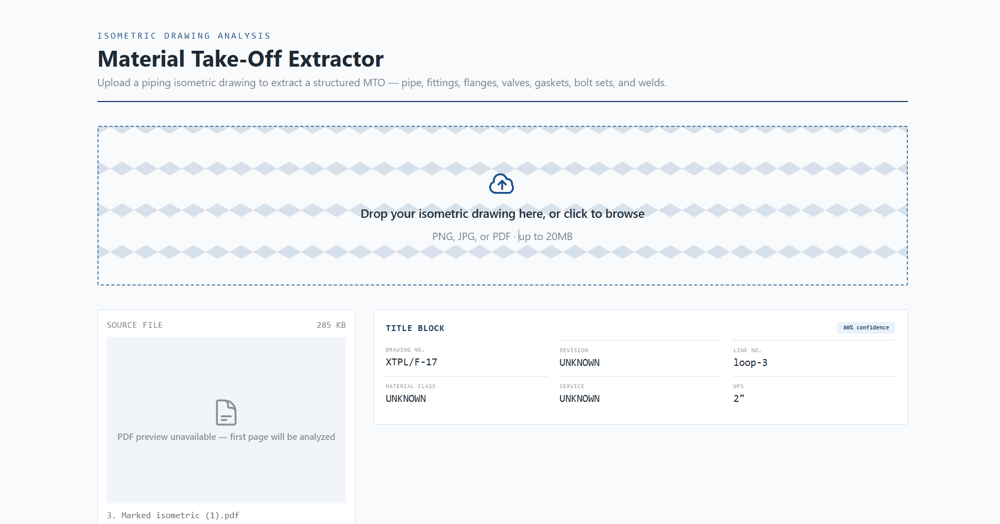
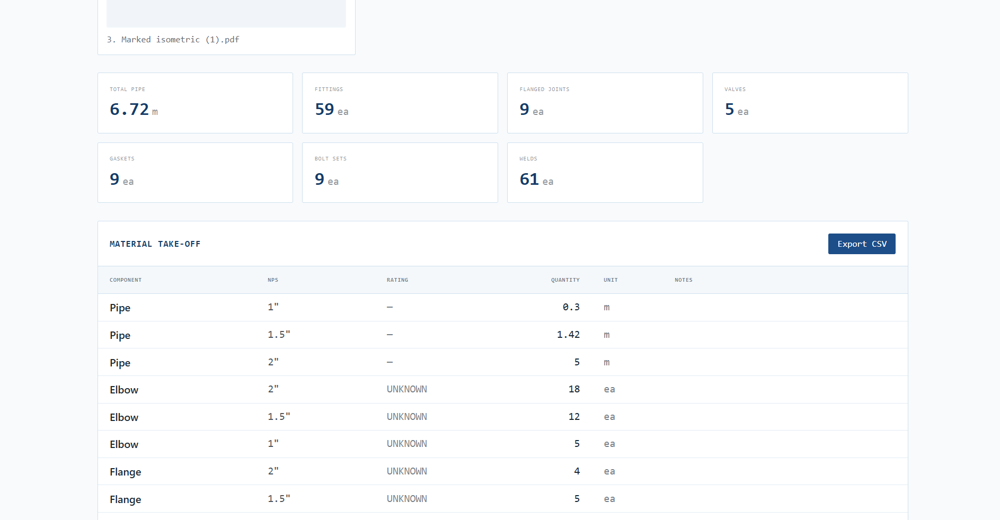
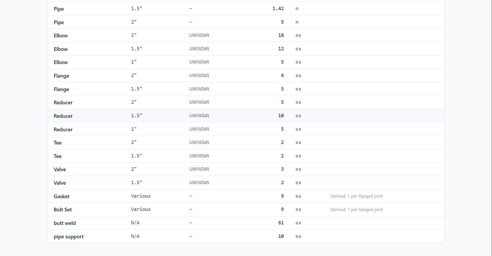
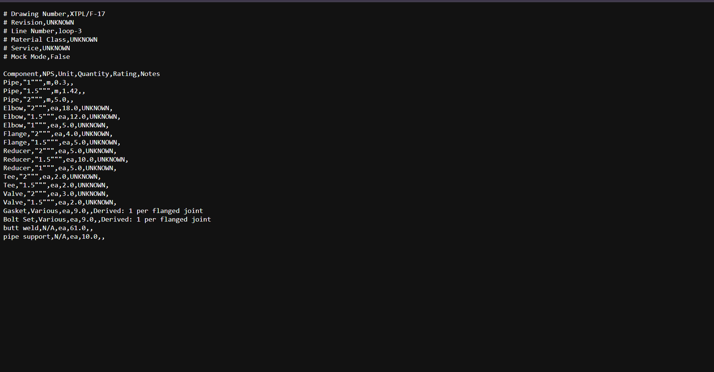

# Isometric MTO Extractor

An end-to-end application that takes **one piping isometric drawing** (PNG,
JPG, or PDF), reads it with **Gemini Vision**, validates and normalizes the
extracted data, derives quantities that aren't drawn explicitly (gaskets,
bolt sets), and presents a structured **Material Take-Off (MTO)** with CSV
export.

The app **never crashes for lack of an API key** — without `GEMINI_API_KEY`
set, it runs in a clearly-labelled **Mock Mode** that returns a realistic
sample MTO so the full pipeline (upload → validate → derive → display →
export) can always be exercised.

---
# Screenshots

## Upload Drawing



## Result





## Generated CSV



## 1. Overview

| | |
|---|---|
| **Frontend** | Next.js 14 (App Router), TypeScript, Tailwind CSS |
| **Backend** | FastAPI, Python 3.11+ |
| **AI** | Google AI Studio — Gemini Vision (`gemini-2.5-flash`) |
| **Validation** | Pydantic v2 |
| **CSV** | pandas |
| **Image/PDF** | Pillow + pdf2image (poppler) |

The user uploads a drawing → the backend converts/pre-processes the image →
sends it to Gemini Vision with a strict JSON-only prompt → validates the
response against a Pydantic schema → applies piping business rules (unit
normalization, gasket/bolt-set derivation, summary totals) → returns a
single validated JSON object the frontend renders as a title block, summary
cards, and a line-item MTO table with CSV export.

## 2. Architecture

```
┌─────────────┐        POST /api/extract         ┌──────────────────────────┐
│   Next.js   │ ────────────────────────────────▶ │         FastAPI          │
│  (frontend) │                                    │                          │
│             │ ◀──────────────────────────────── │  1. validate upload      │
└─────────────┘        MTOResult (JSON)            │  2. PDF → image (if PDF) │
                                                    │  3. resize / enhance     │
      GET /api/export/csv                          │  4. Gemini Vision call   │
      (re-renders last result as CSV)               │     — or Mock Mode      │
                                                    │  5. Pydantic validation  │
                                                    │  6. business logic:      │
                                                    │     normalize units,     │
                                                    │     derive gaskets/      │
                                                    │     bolt sets, totals    │
                                                    └──────────────────────────┘
                                                              │
                                                              ▼
                                                   ┌───────────────────┐
                                                   │  Gemini Vision API │
                                                   │  (skipped if no    │
                                                   │   API key → mock)  │
                                                   └───────────────────┘
```

## 3. Folder structure

```
isometric-mto/
├── backend/
│   ├── app/
│   │   ├── api/routes.py          # /health, /extract, /export/csv
│   │   ├── pipeline/
│   │   │   ├── extract.py         # orchestrates the full pipeline
│   │   │   └── business_logic.py  # unit normalization + derivations
│   │   ├── services/
│   │   │   ├── image_service.py   # PDF→image, resize, enhance
│   │   │   ├── gemini_service.py  # Gemini Vision call + strict prompt
│   │   │   └── mock_service.py    # realistic sample extraction
│   │   ├── schemas/mto.py         # Pydantic contracts (raw + final)
│   │   ├── models/                # reserved for persistence models
│   │   ├── utils/csv_export.py    # pandas-based CSV rendering
│   │   ├── tests/                 # pytest suite
│   │   ├── config.py              # centralized Settings (env-driven)
│   │   └── main.py                # FastAPI app entrypoint
│   ├── requirements.txt
│   ├── .env.example
│   └── Dockerfile
├── frontend/
│   ├── app/                       # App Router: layout.tsx, page.tsx
│   ├── components/                # UploadZone, MTOTable, SummaryCards, ...
│   ├── lib/                       # api.ts (backend client), types.ts
│   ├── package.json
│   ├── .env.example
│   └── Dockerfile
├── sample_drawings/
├── screenshots/
├── docker-compose.yml
└── README.md
```

## 4. Installation

### Prerequisites
- Python 3.11+
- Node.js 18+
- `poppler-utils` installed locally (only needed for PDF input) — e.g.
  `apt-get install poppler-utils` / `brew install poppler`

### Backend

```bash
cd backend
python -m venv .venv && source .venv/bin/activate
pip install -r requirements.txt
cp .env.example .env        # leave GEMINI_API_KEY blank to run in Mock Mode
uvicorn app.main:app --reload
```

Backend runs at `http://localhost:8000`. Interactive docs at `/docs`.

### Frontend

```bash
cd frontend
npm install
cp .env.example .env.local
npm run dev
```

Frontend runs at `http://localhost:3000`.

### Docker (bonus)

```bash
cp backend/.env.example backend/.env   # fill in GEMINI_API_KEY if you have one
docker compose up --build
```

## 5. Commands

| Command | Where | Purpose |
|---|---|---|
| `uvicorn app.main:app --reload` | backend | Run dev server |
| `pytest app/tests -v` | backend | Run test suite |
| `npm run dev` | frontend | Run dev server |
| `npm run build` | frontend | Production build |
| `docker compose up --build` | root | Run both services in containers |

## 6. Environment variables

**Backend (`backend/.env`)**
```
GEMINI_API_KEY=      # leave blank for Mock Mode
MODEL_NAME=gemini-2.5-flash
```

**Frontend (`frontend/.env.local`)**
```
NEXT_PUBLIC_API=http://localhost:8000
```

## 7. AI pipeline

1. **Validate** file extension and size (`app/pipeline/extract.py`).
2. **Convert** PDF → image, first page only (`pdf2image`, `app/services/image_service.py`).
3. **Preprocess**: bound the longest edge to 2048px and auto-contrast, to
   keep vision latency/cost predictable without losing legibility.
4. **Call Gemini Vision** with the raw image bytes and a strict prompt
   (`app/services/gemini_service.py`), requesting `response_mime_type:
   application/json` so the model is constrained to JSON output.
5. **Validate** the returned JSON against a Pydantic `ExtractionRaw` schema
   — malformed or incomplete responses raise `GeminiExtractionError`.
6. **Normalize + derive** (`app/pipeline/business_logic.py`): group pipe by
   NPS and sum lengths, group fittings/valves/flanges by type+NPS+rating,
   derive **1 gasket + 1 bolt set per flanged joint**, and compute summary
   totals.
7. **Return** a single validated `MTOResult` — the same shape whether it
   came from a live Gemini call or Mock Mode.

## 8. Gemini prompt strategy

The prompt (`EXTRACTION_PROMPT` in `gemini_service.py`) is deliberately:

- **JSON-only, schema-first** — the exact target JSON shape is given
  in the prompt itself, so the model has no ambiguity about field names,
  nesting, or types.
- **Estimation over omission** — the model is told to make its best
  engineering estimate for illegible fields and reflect that in a
  `confidence` score, rather than dropping fields, so the schema
  validation step never fails on missing keys.
- **Scoped** — gaskets and bolt sets are explicitly excluded from what
  Gemini should return, since those are derived downstream from flange
  counts (a drawing rarely draws gaskets as distinct symbols, so asking
  the model to count them would be unreliable).
- **Unit-normalized at the source** — the model is told to convert
  imperial dimensions to meters itself, since it has the visual context
  (dimension text, scale) needed to do that conversion correctly.

## 9. Mock Mode

Mock Mode is a single source of truth in `Settings.mock_mode`
(`app/config.py`): true whenever `GEMINI_API_KEY` is empty. It is also used
as an automatic **fallback** if a live Gemini call fails for any reason
(network error, invalid JSON, schema validation failure) — the API never
returns a 500 solely because Gemini was unavailable; it degrades to Mock
Mode and surfaces a warning in the response instead.

The frontend shows a **"Mock Mode"** badge on the title block whenever
`mock_mode: true` is present in the response.

## 10. Assumptions

- Only the **first page** of a multi-page PDF is analyzed (multi-page
  support is listed as a bonus item — see Limitations).
- "Flanged joint" = one flange listed in the extraction; each flange
  requires its own gasket and bolt set (standard piping take-off
  convention), rather than trying to pair flanges into joints.
- Pipe schedule (`STD`, `XS`, etc.) is tracked per segment but not currently
  broken out as a separate MTO grouping key — segments are grouped by NPS
  only, since schedule rarely changes the take-off unit count.
- The backend keeps only the **most recent** extraction result in memory
  for CSV export (no database) — sufficient for a single-session
  assessment tool, not for concurrent multi-user production use.

## 11. Limitations

- Only the first page of a PDF is processed.
- No persistence layer — restarting the backend clears the last result.
- No authentication/authorization (out of scope for this assessment).
- Gemini Vision's accuracy on hand-drawn or low-resolution scans will vary;
  the `confidence` score and `warnings` array are the app's only signal of
  that uncertainty back to the user today.
- Weld and support detection are best-effort — isometrics don't always mark
  these symbols consistently, and the prompt makes no special attempt to
  disambiguate weld types beyond what's asked.

## 12. Future improvements

- Multi-page PDF support (analyze every page, merge results).
- Bounding-box overlay: have Gemini return pixel coordinates per component
  so the frontend can highlight each detected symbol on the drawing image.
- Persist extraction history (e.g. SQLite) so past drawings are browsable.
- Confidence visualization per field, not just a single overall score.
- Automatic weld-type classification (butt vs socket vs threaded) from
  visual symbol shape.

## 13. Testing

```bash
cd backend
pytest app/tests -v
```

Covers:
- `test_health.py` — health endpoint
- `test_extract.py` — upload/extract endpoint, mock MTO shape, rejection of
  bad file types and empty files
- `test_business_logic.py` — Pydantic schema validation, unit grouping,
  gasket/bolt-set derivation matching flange count exactly
- `test_csv_export.py` — CSV export after an extraction, and a 404 when no
  extraction has run yet

All 10 tests pass with no warnings.

## 14. Interview explanation

**"Walk me through what happens when I upload a drawing."**

The file lands on `POST /api/extract` as multipart form data. It's
validated for extension and size before anything else touches it — cheap
checks first. If it's a PDF, `pdf2image` (backed by poppler) rasterizes the
first page to an image; otherwise the image is used directly. The image is
then bounded to a max 2048px edge and auto-contrasted — this keeps the
Gemini Vision payload small and consistent regardless of what the user
uploaded.

If no `GEMINI_API_KEY` is configured, none of that image work is wasted —
`Settings.mock_mode` short-circuits the pipeline straight to a realistic
sample extraction. Otherwise, the image is sent to Gemini Vision with a
prompt that pins down the exact JSON shape we need, and the model is asked
for JSON-only output. Whatever comes back is parsed and validated against a
Pydantic schema — if that fails for any reason (bad JSON, missing fields,
wrong types), we don't 500 the request; we log the failure and fall back to
Mock Mode with a warning attached, so the user always gets a usable result.

From there, the same business-logic function runs regardless of where the
data came from: pipe segments are grouped and summed by NPS, fittings are
grouped by type/NPS/rating, and — this is the one piece of domain knowledge
that isn't just "read what's on the drawing" — every flange face implies
exactly one gasket and one bolt set, which the drawing itself doesn't
usually depict as separate symbols. That derivation, plus the summary
totals, is computed once and returned as a single validated JSON object,
which is the same shape the frontend renders whether it came from Gemini or
Mock Mode. The frontend never needs to know which path produced it — it
just checks the `mock_mode` flag to show the badge.
